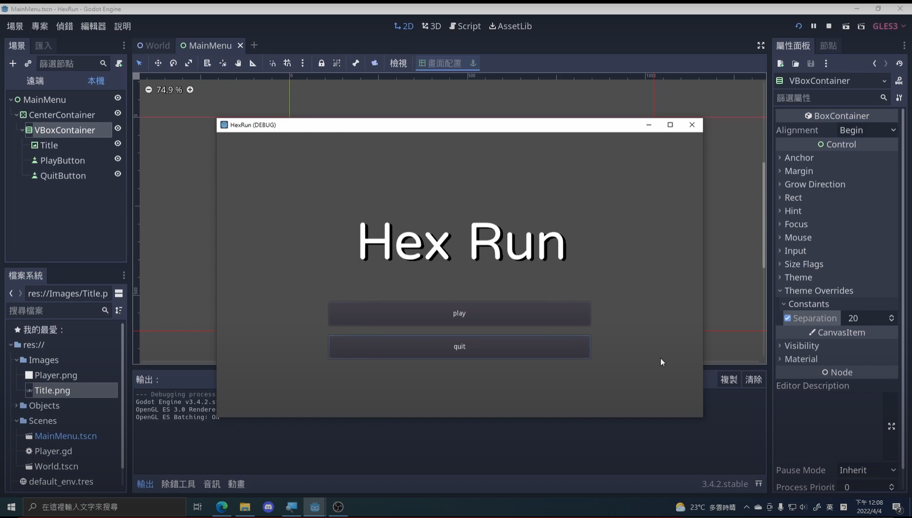
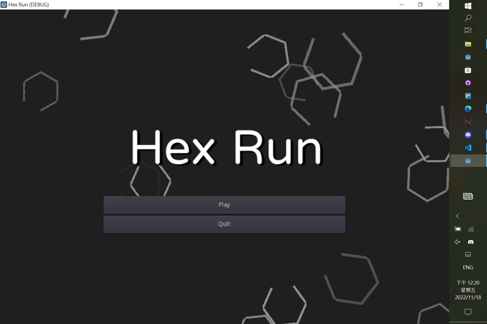

# HexRun
[收音機](https://www.youtube.com/@radio0529) 的[HexRun 教學](https://www.youtube.com/watch?v=X8p3HK-h8R4) 教學，適合英文不太好的Godot初學者

master是教學的版本，這是我魔改後的版本

魔改前
(來自[收音機](https://www.youtube.com/@radio0529))

魔改後

